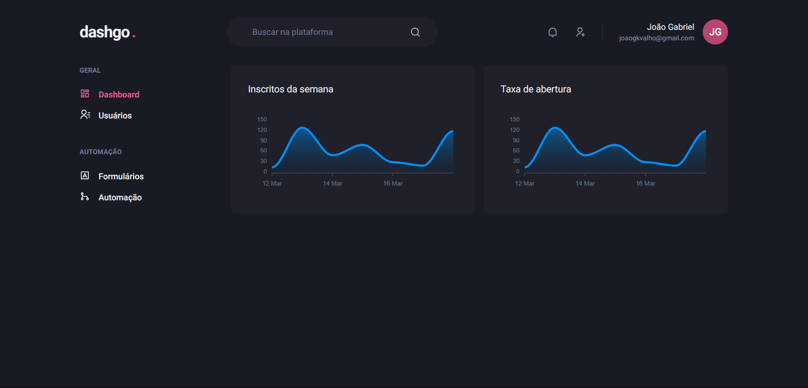

<h1 align="center"> Dashgo </h1>

  <a href="#-tecnologias">Tecnologias</a>&nbsp;&nbsp;&nbsp;|&nbsp;&nbsp;&nbsp;
  <a href="#-projeto">Projeto</a>&nbsp;&nbsp;&nbsp;|&nbsp;&nbsp;&nbsp;
  <a href="#memo-licença">Licença</a>

  

 

  

## 🚀 Tecnologias

Esse projeto foi desenvolvido com as seguintes tecnologias:

- React
- TypeScript
- NextJS
- ChakraUI
- React Hook Form
- ApexCharts
- Axios
- Yup

## 🔥 Algumas features neste projeto

- React Hooks
- UseState
- UseEffect
- Criação de um hook personalizado UseUsers
- Criação de dados fictícios com a lib mirageJS
- Autenticação de formulário com yup e React Hook Form
- Estilização com ChakraUI
- Gráficos com a biblioteca apex-charts

## ✨ Neste projeto você pode ver

- Uma página de login com validação de formulário utilizando yup e react-hook-form.
- Uma página de dashboard com gráficos criados com a biblioteca apex-charts.
- Na página de usuários uma lista de usuários com paginação funcional.
- Um formulário para criação de novos usuários com validação de formulário.

## 💻 Projeto

- Dashgo é um dashboard simples com todas funcionalidades básicas criado com React e ChakraUI.

## ✅ Esse projeto foi criado ao longo do curso Ignite ReactJS da plataforma Rocketseat

## 📝 Licença

Esse projeto está sob a licença MIT.

---
